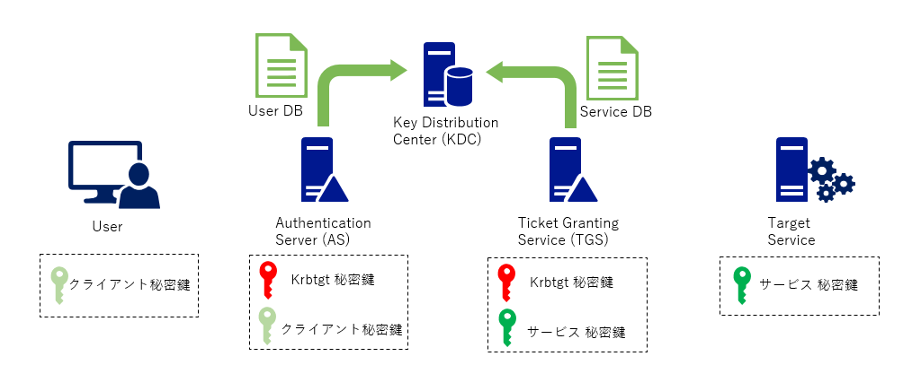
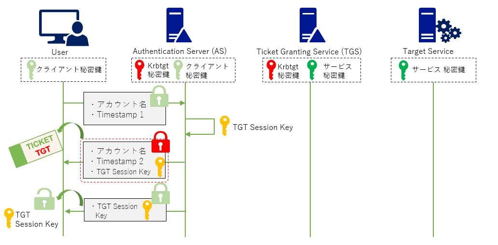
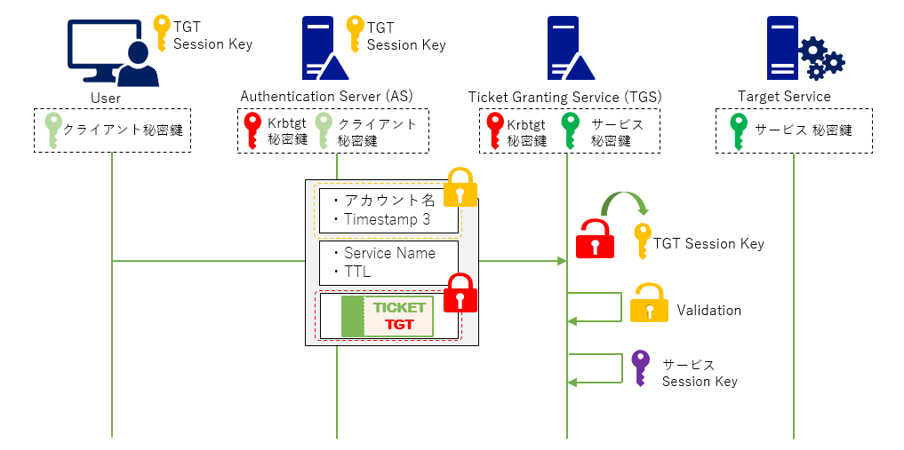

# Kerberoasting

Kerberoasting とは
-------------

Kerberoasting とは Service Principal Names (SPN) が設定されているサービスへアクセスするためのサービスチケット (ST) をローカルでクラックすることによって当該サービスのパスワードを取得する攻撃です。

Kerberos 認証について
-------------

