# Splunk

Splunk サーバの構築と Splunk Universal Forwarder のインストール
-------------

ログの確認および検知ルールの検討を容易にするために Splunk 環境を構築します。
検証環境に Splunk Universal Forwarder をインストールし、イベントログを Splunk サーバへ集約します。
本章では Splunk 環境の構築手順について記載します。

インストーラ
-------------

以下のサイトからインストーラのダウンロードを行います。

**Splunk Enterprise のダウンロード**
https://www.splunk.com/en_us/download/splunk-enterprise.html

**Splunk Universal Forwarder のダウンロード**
https://www.splunk.com/en_us/download/universal-forwarder.html

2021年4月3日時点では以下のバージョンとなります。
- Splunk Enterprise 8.1.3
- Splunk Universal Forwarder 8.1.3

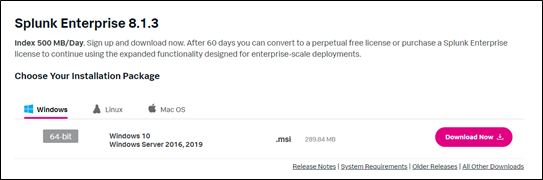

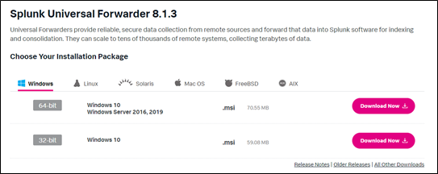

Splunkサーバの構築
-------------

今回は、検証環境にそれぞれ Splunk Universal Forwarder をインストールします。

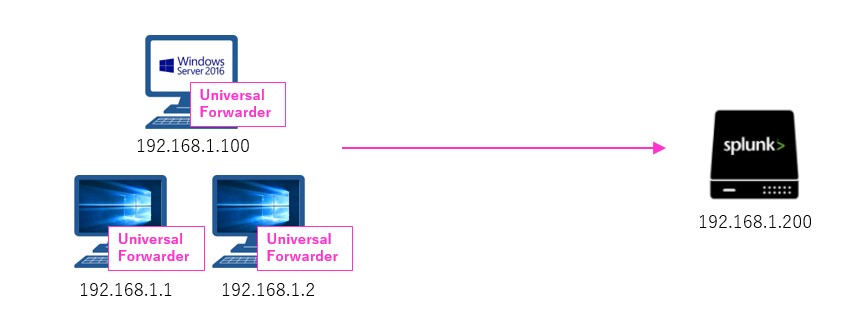

Splunk をインストールするサーバ上で、インストーラを実行します。
その後は以下の手順に従ってインストールを完了させます。

・ライセンスに同意し「Customize Options」を押下します。

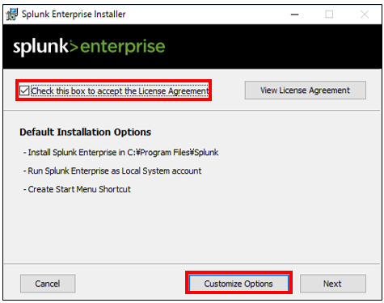

・そのまま「Next」で進めます。

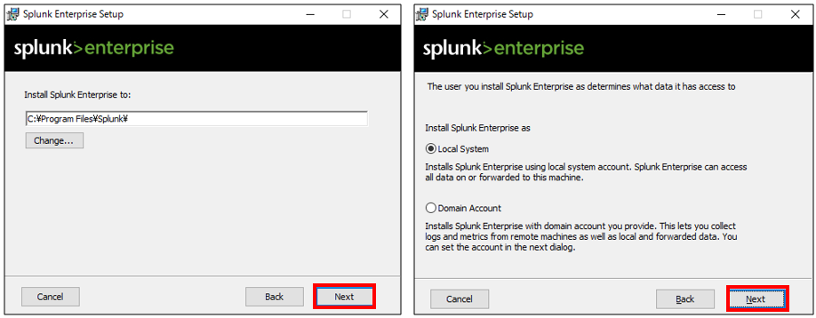

・管理者の Username と Password を設定します。

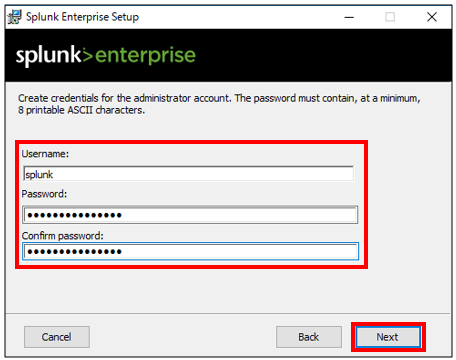

・「Install」を押下しインストールを開始します。インストールが完了した後に「Finish」を押下しインストールを完了させます。

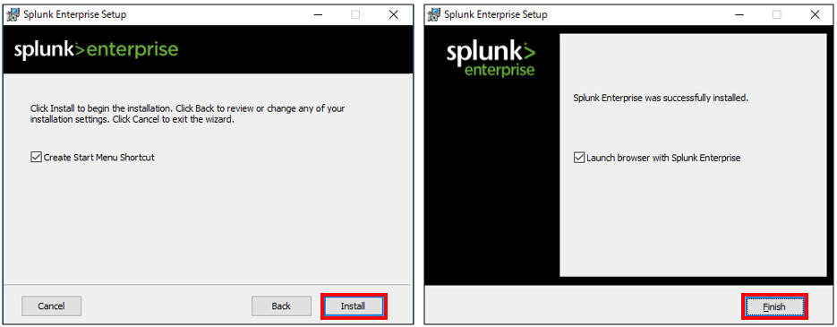

・インストール後、ブラウザにて「127.0.0.1:8000」にアクセスを行い、インストール時に設定したユーザ名とパスワードでログインを行います。

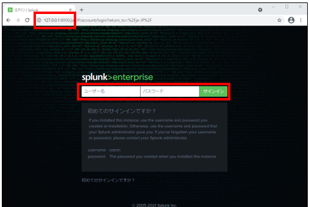

・上部のメニュにある「設定」を押下します。

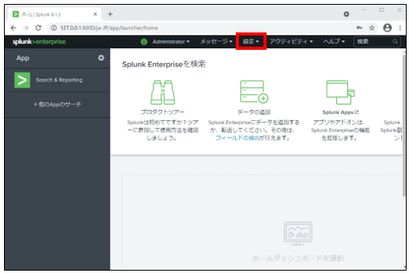

・「データ -> 転送と受信」を選択します。

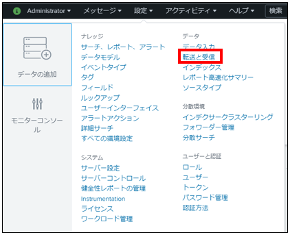

・データの受信で「新規作成」を押下します。

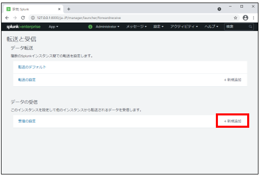

・受信の設定にて Listen するポート番号を設定します。ここではデフォルトのポート番号である 9997 を設定しています。

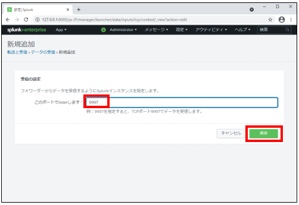

・Windows Firewall で Listen ポートである 9997 番ポートを解放します。規則の種類で「ポート」を選択します。

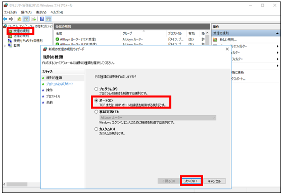

・「TCP」の特定のローカルポートとして 9997 を設定します。

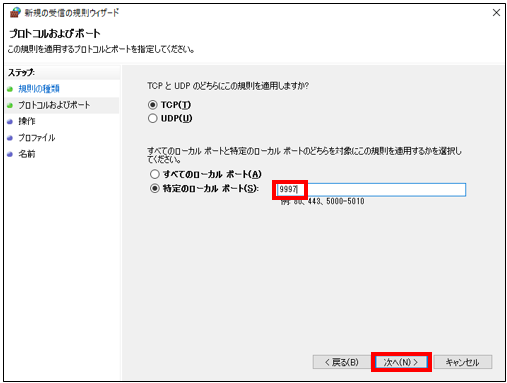

・ログ受信用のルールが設定されたことを確認します。ここではルール名を「Splunk Universal Forwarder」としています。

