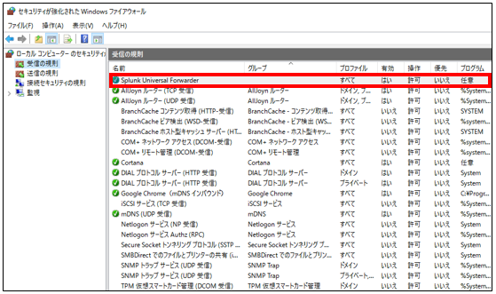

# Splunk

Splunk サーバの構築と Splunk Universal Forwarder のインストール
-------------

ログの確認および検知ルールの検討を容易にするために Splunk 環境を構築します。
検証環境に Splunk Universal Forwarder をインストールし、イベントログを Splunk サーバへ集約します。
本章では Splunk 環境の構築手順について記載します。

ログ転送の構成
-------------

今回は、検証環境にそれぞれ Splunk Universal Forwarder をインストールしイベントログを Splunk サーバへ転送します。


インストーラ
-------------

以下のサイトからインストーラのダウンロードを行います。

**Splunk Enterprise のダウンロード**

https://www.splunk.com/en_us/download/splunk-enterprise.html


**Splunk Universal Forwarder のダウンロード**

https://www.splunk.com/en_us/download/universal-forwarder.html

2021年4月3日時点では以下のバージョンとなります。
- Splunk Enterprise 8.1.3
- Splunk Universal Forwarder 8.1.3


Splunk のインストール
-------------

Splunk をインストールするサーバ上で、インストーラを実行します。
その後は以下の手順に従ってインストールを完了させます。

・ライセンスに同意し「Customize Options」を押下します。


・そのまま「Next」で進めます。


・管理者の Username と Password を設定します。


・「Install」を押下しインストールを開始します。インストールが完了した後に「Finish」を押下しインストールを完了させます。


・インストール後、ブラウザにて「127.0.0.1:8000」にアクセスを行い、インストール時に設定したユーザ名とパスワードでログインを行います。


・上部のメニュにある「設定」を押下します。


・「データ -> 転送と受信」を選択します。


・データの受信で「新規作成」を押下します。


・受信の設定にて Listen するポート番号を設定します。ここではデフォルトのポート番号である 9997 を設定しています。


・Windows Firewall で Listen ポートである 9997 番ポートを解放します。規則の種類で「ポート」を選択します。


・「TCP」の特定のローカルポートとして 9997 を設定します。


・ログ受信用のルールが設定されたことを確認します。ここではルール名を「Splunk Universal Forwarder」としています。




Splunk APP の追加
-------------

APP を追加するためには、APP のサーチから APP の名称で検索することが可能です。


本検証環境では、以下の APP をインストールします。

- Splunk Add-on for Microsoft Windows
- Splunk Add-On for Microsoft Sysmon
- Force Directed App For Splunk

Splunk Universal Forwarder のインストール
-------------

ログを取得したい端末にて Splunk Universal Forwarder をインストールします。
標準機能でのイベントログの転送設定後、拡張ログである Powershell ログ、および Sysmon を転送するための設定を追加していきます。

・Splunk Universal Forwarder のインストーラを実行します。ライセンスに同意し On-premise を選択したのち「Customize Options」を押下します。


・そのまま「Next」で進めます。


・証明書は設定せずに進めます。


・ローカルシステムでのインストールを選択します。


・転送するログについては、「Application Logs」「Security Logs」「System Logs」を選択します。


・管理者の Username と Password を設定します。


・Deployment Server は構築しないためブランクで進めます。


・構築した Splunk サーバの IP アドレスとポート番号を設定します。


・その後、「Install」を押下することでインストールが開始されます。


拡張ログの転送設定
-------------

追加の設定として、以下の拡張ログを転送する設定を行います。

- Microsoft-Windows-PowerShell/Operational
- Microsoft-Windows-Sysmon/Operational
- Microsoft-Windows-Sysmon/Operational

Splunk Universal Forwarder の設定ファイルである inputs.conf ファイルで追加の転送設定が可能です。


C:\Program Files\SplunkUniversalForwarder\etc\system\local ディレクトリにある inputs.conf ファイルに以下の内容を追記します。

```
[default]
host = user1-PC※ホスト名を入れる

[WinEventLog://Microsoft-Windows-PowerShell/Operational]
disabled = false
renderXml = true

[WinEventLog://Microsoft-Windows-Sysmon/Operational]
disabled = false
renderXml = true

[WinEventLog://Microsoft-Windows-Sysmon/Operational]
disabled = false
renderXml = true
```

inputs.conf ファイルの設定を反映させるために、サービスより Splunk Forwarder Service を再起動します。


サービスの再起動後から、追加のログの転送が開始されます。