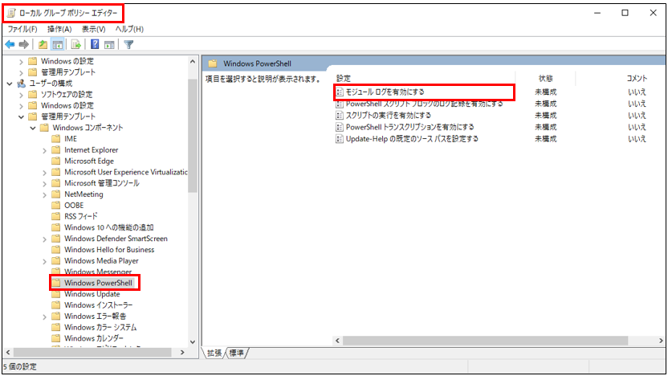
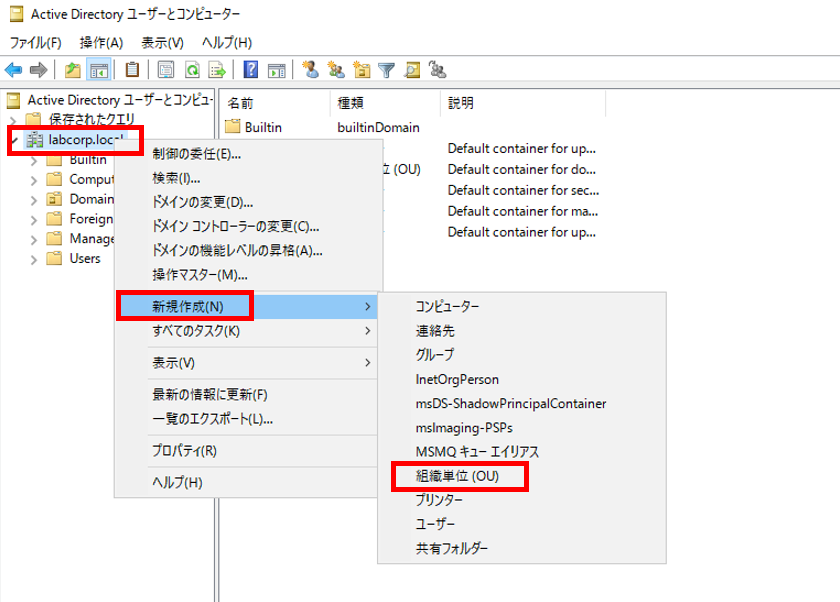
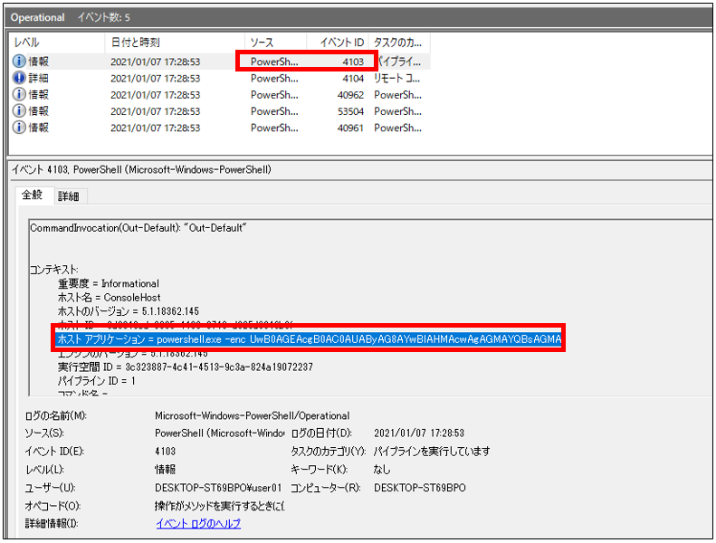
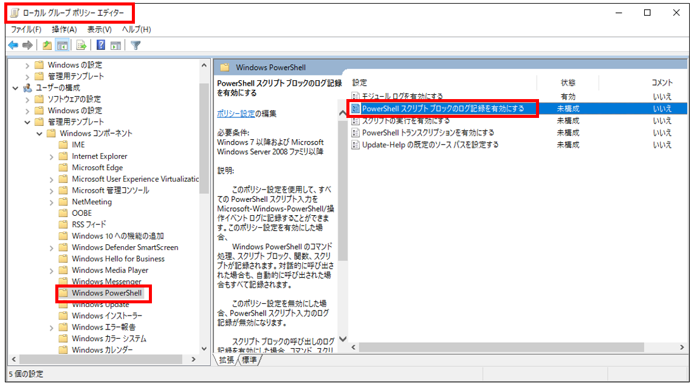
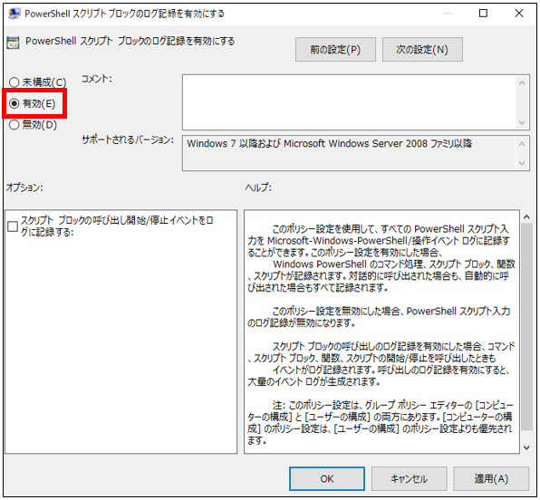

# Enable Logging - Powershell

Enable Logging
-------------

検証環境では以下のログ拡張を適用します。

- Sysmon
- PowerShellログ モジュールログ (EID4103)
- PowerShellログ スクリプトブロックログ (EID4104)


PowerShellログ モジュールログ (EID4103)
-------------

ローカルグループポリシーエディタを開き、「Windows Powershell」 -> 「モジュールログを有効にする」をクリックします。



オプションの「表示」をクリックし下記を入力します。

```
Microsoft.PowerShell.*
Microsoft.WSMan.Management
```



その後、「有効」にチェックをいれることでモジュールログの出力を有効化することができます。
最後に、イベントログにおいてモジュールログのイベント ID  4103 が出力されることを確認します。




PowerShellログ スクリプトブロックログ (EID4104)
-------------

ローカルグループポリシーエディタを開き、「Windows Powershell」 -> 「PowerShell スクリプトブロックのログ記録を有効にする」をクリックします。



「有効」にチェックをいれることでスクリプトブロックの出力を有効化することができます。
最後に、イベントログにおいてスクリプトブロックログのイベント ID  4104 が出力されることを確認します。



