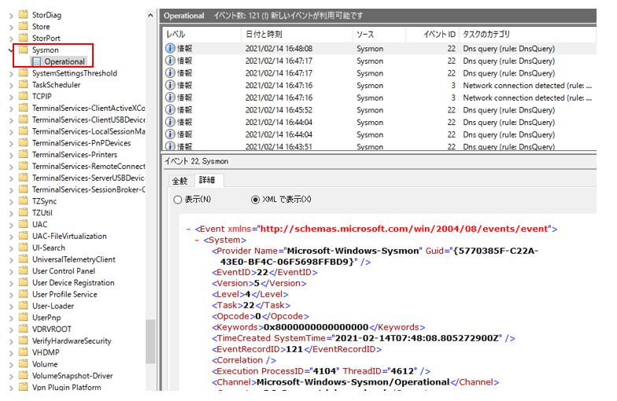

# Enable Logging - Sysmon

Enable Logging
-------------

検証環境では以下のログ拡張を適用します。

- Sysmon
- PowerShellログ モジュールログ (EID4103)
- PowerShellログ スクリプトブロックログ (EID4104)


Sysmon
-------------
ロギング拡張として Sysmon をインストールする手順を記載します。

PowerShell を管理者権限で起動させ、Sysmon をインストールするためのフォルダを作成します。

```
PS C:\Users\Administrator> mkdir c:\Lab\Sysmon


    ディレクトリ: C:\Lab


Mode                LastWriteTime         Length Name
----                -------------         ------ ----
d-----       2021/02/14     15:12                Sysmon


PS C:\Users\Administrator> cd c:\Lab\Sysmon
PS C:\Lab\Sysmon>
```
Invoke-WebRequest での TLS 1.2 を許可させます。
```
PS C:\Users\Administrator> [Net.ServicePointManager]::SecurityProtocol = [Net.SecurityProtocolType]::Tls12
```
Sysmon のインストーラと Sysmon のコンフィグファイルをダウンロードします。
ここでは、Olaf Hartong氏が公開しているコンフィグを利用します。
```
PS C:\Lab\Sysmon> Invoke-WebRequest -URI https://download.sysinternals.com/files/Sysmon.zip -OutFile "Sysmon.zip"
PS C:\Lab\Sysmon> Invoke-WebRequest -URI https://github.com/olafhartong/sysmon-modular/archive/master.zip -OutFile "sysmon-modular.zip"
```

ダウンロードした zip ファイルをそれぞれ展開します。

```
PS C:\Lab\Sysmon> Expand-Archive .\Sysmon.zip
PS C:\Lab\Sysmon> Expand-Archive .\sysmon-modular.zip
PS C:\Lab\Sysmon> ls


    ディレクトリ: C:\Lab\Sysmon


Mode                LastWriteTime         Length Name
----                -------------         ------ ----
d-----       2021/02/14     15:21                Sysmon
d-----       2021/02/14     15:21                sysmon-modular
-a----       2021/02/14     15:18        2072511 sysmon-modular.zip
-a----       2021/02/14     15:17        1912525 Sysmon.zip
```

Sysmon のコンフィグファイルは以下の構成となっています。


ここで、付属されているコンフィグマージツール Merge-SysmonXml.ps1 を用いて、インストール時に指定する
コンフィグファイル sysmonconfig.xml を生成します。

```
PS C:\Lab\Sysmon\sysmon-modular\sysmon-modular-master> Import-Module .\Merge-SysmonXml.ps1
PS C:\Lab\Sysmon\sysmon-modular\sysmon-modular-master> Merge-AllSysmonXml -Path ( Get-ChildItem '[0-9]*\*.xml') -AsString | Out-File sysmonconfig.xml
PS C:\Lab\Sysmon\sysmon-modular\sysmon-modular-master> cp .\sysmonconfig.xml C:\Lab\Sysmon\Sysmon\
PS C:\Lab\Sysmon\sysmon-modular\sysmon-modular-master> cd C:\Lab\Sysmon\Sysmon\
PS C:\Lab\Sysmon\Sysmon> ls


    ディレクトリ: C:\Lab\Sysmon\Sysmon


Mode                LastWriteTime         Length Name
----                -------------         ------ ----
-a----       2021/01/19     20:11           7490 Eula.txt
-a----       2021/01/19     20:11        4844416 Sysmon.exe
-a----       2021/01/19     20:11        2591096 Sysmon64.exe
-a----       2021/02/14     16:29         320466 sysmonconfig.xml
```

「-i」オプションで sysmonconfig.xml を指定して Sysmon のインストールを実行します。

```
PS C:\Lab\Sysmon\Sysmon> ./sysmon64.exe -accepteula -i sysmonconfig.xml


System Monitor v13.01 - System activity monitor
Copyright (C) 2014-2021 Mark Russinovich and Thomas Garnier
Sysinternals - www.sysinternals.com

Loading configuration file with schema version 4.50
Configuration file validated.
Sysmon64 installed.
SysmonDrv installed.
Starting SysmonDrv.
SysmonDrv started.
Starting Sysmon64..
Sysmon64 started.
```

最後に、イベントログに Sysmon ログが出力されていることを確認します。

