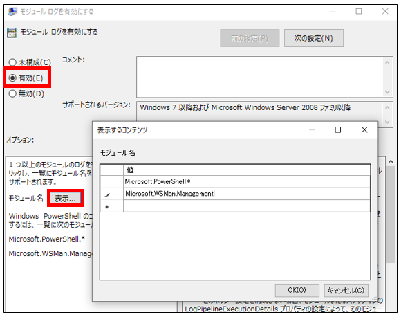
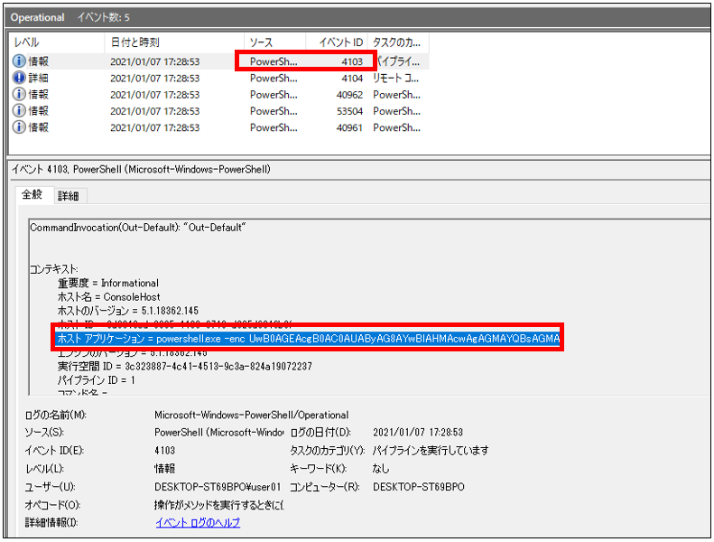
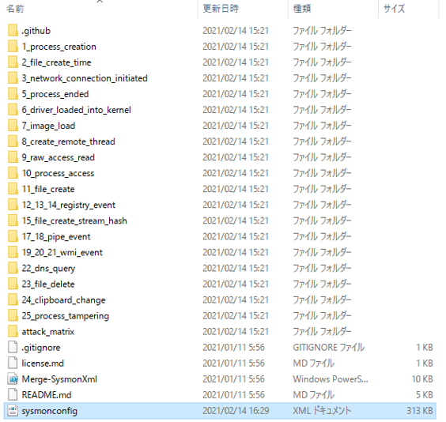

# ロギング拡張 - Powershell

ロギング拡張
-------------

検証環境では以下のログ拡張を適用します。

- Sysmon
- PowerShellログ モジュールログ (EID4103)
- PowerShellログ スクリプトブロックログ (EID4104)
- PowerShellログ トランスクリプション (テキスト出力)


PowerShellログ モジュールログ (EID4103)
-------------

ローカルグループポリシーエディタを開き、「Windows Powershell」 -> 「モジュールログを有効にする」をクリックします。


オプションの「表示」をクリックし下記を入力します。

```
Microsoft.PowerShell.*
Microsoft.WSMan.Management
```



その後、「有効」にチェックをいれることでモジュールログの出力を有効化することができます。
最後に、イベントログにおいてモジュールログのイベント ID  4103 が出力されることを確認します。




PowerShellログ スクリプトブロックログ (EID4104)
-------------


PowerShellログ トランスクリプション (テキスト出力)
-------------



