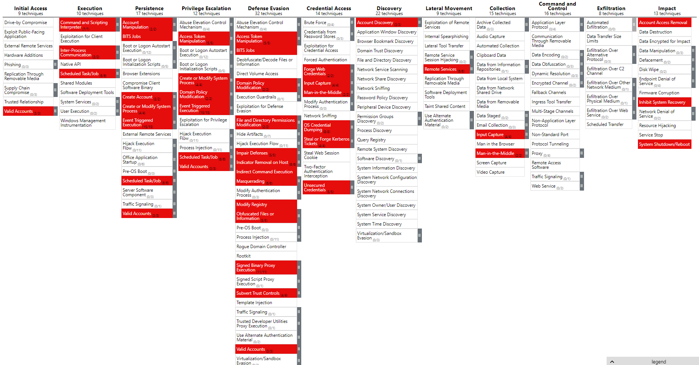

# yeaの目標

下記MITRE ATT&CKの下記画像の赤く塗られている項目を検知すること


赤く塗られているところは下記の情報を元に  
https://github.com/mitre-attack/attack-website/blob/master/data/stix/enterprise-attack.json  
Windowsイベントログで検知できるものを抽出  

全部で51種類
```
AS-REP Roasting
Access Token Manipulation
Account Access Removal
Account Manipulation
At (Windows)
BITS Jobs
CMSTP
Command and Scripting Interpreter
Component Object Model and Distributed COM
Create Account
Create or Modify System Process
Credential API Hooking
DCSync
Disable Windows Event Logging
Distributed Component Object Model
Domain Account
Event Triggered Execution
File and Directory Permissions Modification
Golden Ticket
Group Policy Preferences
Image File Execution Options Injection
Indicator Removal on Host
Indirect Command Execution
Inhibit System Recovery
Input Capture
Kerberoasting
LLMNR/NBT-NS Poisoning and SMB Relay
Local Account
Masquerade Task or Service
Modify Registry
NTDS
Obfuscated Files or Information
Parent PID Spoofing
PowerShell
Remote Services
SID-History Injection
SIP and Trust Provider Hijacking
Scheduled Task
Scheduled Task/Job
Silver Ticket
Steal or Forge Kerberos Tickets
Subvert Trust Controls
System Shutdown/Reboot
Unsecured Credentials
Windows Command Shell
Windows File and Directory Permissions Modification
Windows Service
Domain Policy Modification
Group Policy Modification
Domain Trust Modification
SAML Tokens
```